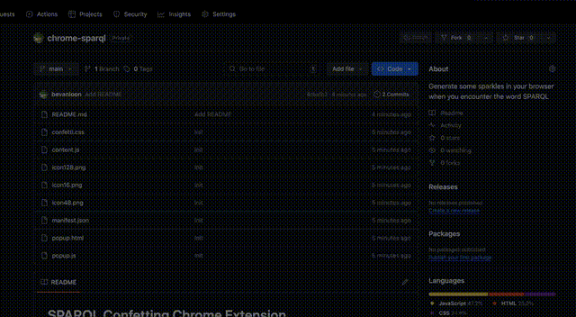

# SPARQL Confetting Chrome Extension

Add some sparkles to your browser when you encounter a web page with the work SPARQL on it.

## Installation

Clone the repo.

Follow the instructions to load [unpacked extensions](https://developer.chrome.com/docs/extensions/get-started/tutorial/hello-world#load-unpacked), selecting the location of the cloned repo.

## Demo

